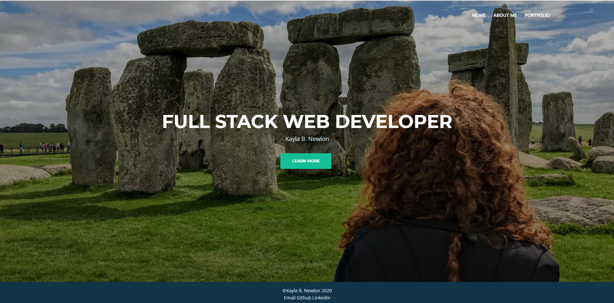
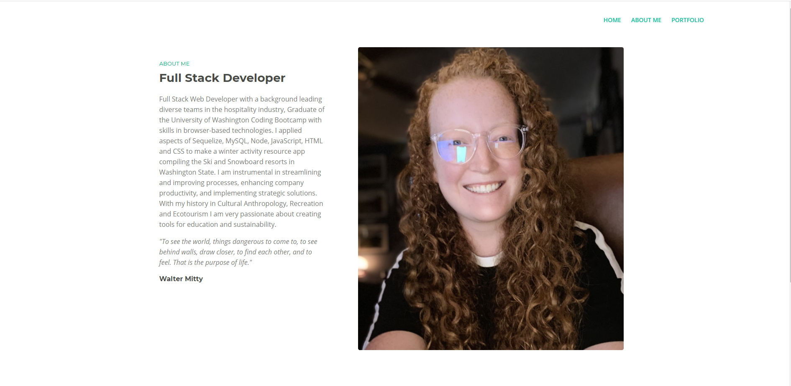
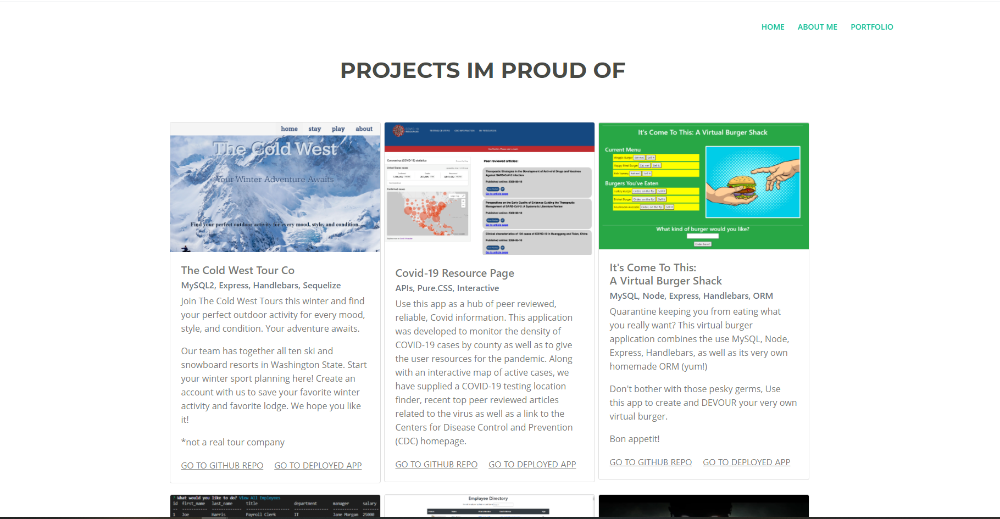

# Portfolio-React

  
## Description 
This app is designed to provide future possible employers a way to see my work, projects I'm proud of, my contact information, linked github and linkedIn profiles, as well as my resume. 

## Table of Contents 
* [Installation](#Installation)
* [Usage](#Usage)
* [Technologies](#Technologies)
* [License](#License)
* [Contributing](#Contributing)
* [Tests](#Tests)
* [Visuals](#Visuals)
* [Links](#Links)
* [Questions](#Questions)

## Installation
1. Use 'git clone git@github.com:kbnewlon/portfolio-react.git' to clone the repo
2. Install necessary dependencies with 'npm install'
3. Run 'npm start' and let react do the rest
4. Enjoy!

## Usage
1. Click on the heroku link below to view my portfolio, made in React
2. This application is split up into three pages and four components
3. The cover page uses the navbar, header, and footer components
4. The about me page uses the navbar and footer components
5. The portfolio page uses the navbar, project, and footer components

## Technologies
* HTML
* CSS 
* JavaScript
* React.js
* Bootstrap 

## License
Copyright (c) 2020, Kayla Newlon. (MIT License)

## Contributing 
N/A 

## Tests
N/A

## Visuals

## Links
To Repo: https://github.com/kbnewlon/portfolio-react
 Visit the deployed app on Heroku to demo: https://kbnewlon-react-portfolio.herokuapp.com/
 

## Questions 
Please contact me if you have any questions at:
 Email: kayla.b.newlon@gmail.com
 Github: https://github.com/kbnewlon
